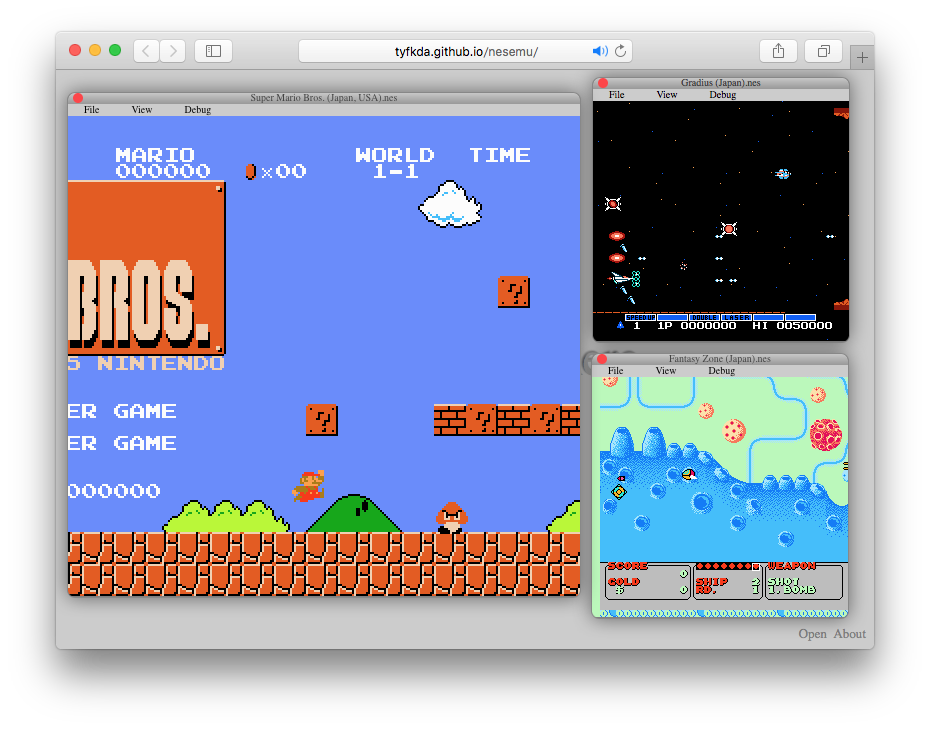

NES Emulator
============

NES emulator written in TypeScript.



## Features

  * Run on a browser
  * Gamepad support
  * Fullscreen
  * Multi-window


## How to play

  * Go to https://tyfkda.github.io/nesemu/
  * Drag and drop a rom file (.nes or .zip) onto the page, the game will be started.


## Control

| NES      | Keyboard   |
|----------|------------|
| Pad      | Cursor key |
| A button | X key      |
| B button | Z key      |
| Start    | Enter      |
| Select   | Space      |

  * You can also use a gamepad


## Development

### Requirement

* node.js
* npm

### Set up

```bash
$ npm install
```

### Build (automatically)

```bash
$ npm start
```

* You can see the page in <http://localhost:3000/>
* Files are generated in `public`

### Release

```bash
$ npm run release
```

* Files are generated in `release`
